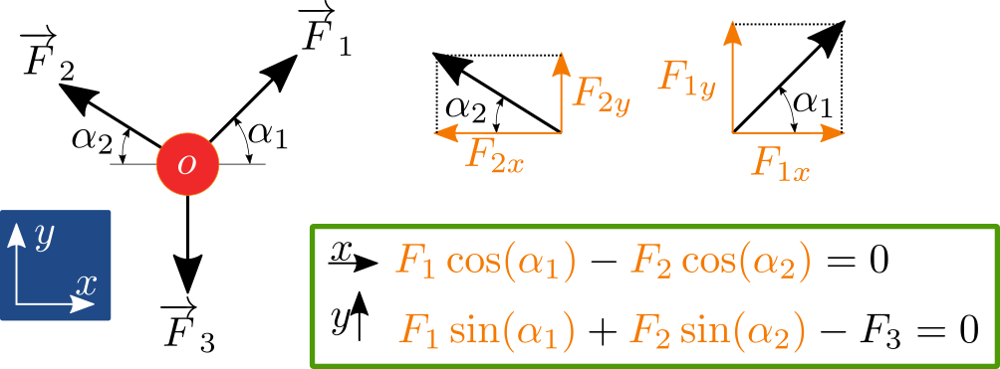

# Statika hmotného bodu a tuhého tělesa, stupně volnosti (☕)

## Rovnováha hmotného bodu

Hmotný bod je v rovnováze tehdy, pokud jsou v rovnováze síly, které na něj působí, tedy vektorový součet sil $F$ musí být roven nule

$$
\overrightarrow{F} = \sum_i \overrightarrow{F}_i = \overrightarrow{0}
$$

Pro výpočet nejdříve zavedeme vhodný souřadnicový systém. Zpravidla kartézský, ortonormálný. Někdy se může hodit vyjádřit síly v polárním souřadnicovém systému nebo v obecném, libovolném křivočarém.

```{admonition} Poznámka
Někdy je možné vypozorovat jakýsi typický směr v silách, které působí na těleso a pak je výhodné umístit směr souřadnicového systému tak aby korespondoval se směrem sil. Ulehčíme si tak práci s hledáním úhlů a rozkladem.
```

<p align="center">
    
</p>

## Rovnováha tuhého tělesa

Rovnováha tuhého tělesa musí zahrnovat i rovnováhu momentů, tedy

$$
\overrightarrow{M} = \sum_i \overrightarrow{M}_i = \overrightarrow{0}
$$

Protože těleso má měřitelný tvar, může rotovat díky momentovým účinkům od sil.

<p align="center">
    
</p>

```{admonition} Poznámka
Rovnováha momentů musí platit k libovolnému bodu tělesa. Místo, ke kterému počítáme rovnováhu momentů zpravidla vybíráme tak abychom měli co nejmenší počet momentových přízpěvků nebo starostí s hledáním ramena momentů.
```

Podle počtu pohybů, které hmotný bod nebo těleso může vykonávat v daném souřadnicovém systému, tak mluvíme o stupních volnosti.

<p align="center">
    
</p>


Hmotný bod ve 2D může vykonávat posuvný pohyb, který lze vyjádřit kombinací pohybu ve směru osy $x$ a a osy $y$. Rotaci není potřeba uvažovat protože bod je bez rozměrný a tak na nem nelze definovat rameno rotace. Podobně platí pro hmotný bod i ve 3D, kde ovažujeme navíc ve stejném duchu souřadnici $z$.

```{admonition} Varování
:class: warning
Pro výpočet momentové rovnováhy musí zvolit kladnou směr otáčení, který se nesmí měnit během výpočtu. Zpravidla je kladný směr uvažován proti směru otáčení hodinových ručiček, avšak není to podmínka.
```

Tuhé těleso má měřitelný rozměr a tak kromě pohybu vyjádřitelného ve třech osách (tj. posuvné stupně volnosti v $x$, $y$ a $z$) musíme uvažovat i obecnou rotaci, kterou lze opět vyjádřit jako kombinaci základních rotací okolo dílčích os ($\phi$, $\xi$ a $\eta$), tedy tří rotačních stupňů volnosti.

Platí tedy, že počet stupňů volnosti pro:
- hmotný bod ve 2D: 2 posuvy
- hmotný bod ve 3D: 3 posuvy
- tuhé těleso ve 2D: 3 (2 posuvy + 1 rotace)
- tuhé těleso ve 3D: 6 (3 posuvy + 3 rotace)

## Příklady k procvičení

Na třetím cvičení jsou představené příklady na výpočet rovnováhy hmotného bodu. Komentované příklady od Petry Tisovské naleznete [zde](https://owncloud.cesnet.cz/index.php/s/B6rnY54Dp7JOsC2).