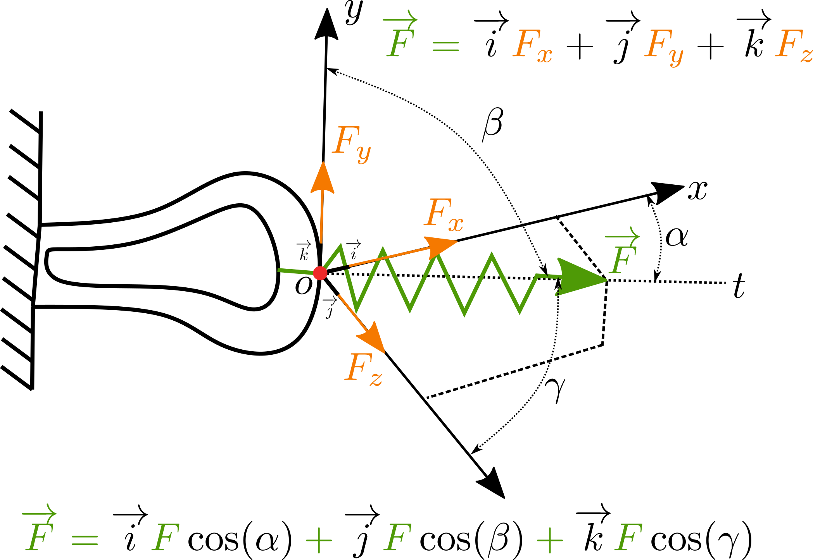
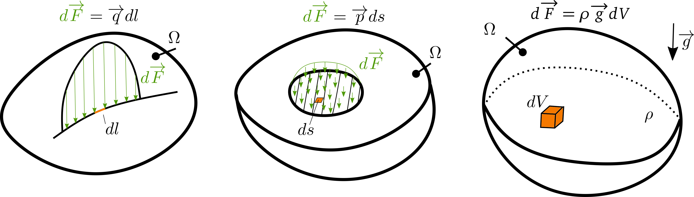

# Účinky síly
## Koncept síly
Síla je projevem interakce dvou těles nebo působení setrvačných a gravitačních účinků na těleso. Sílu rozdělíme na:
- statickou: nemění pohybový stav tělesa, tj. všechny síly jsou v rovnováze
- dynamicou: změna pohybového stavu tělese, vyjádřitelnou 2 Newtonovým zákonem:

$$
\overrightarrow{F} = \frac{d(m\overrightarrow{v})}{dt}
$$
Zaveďme vhodný matematický popis. Uvažujme sílu jako vektor v kártézských souřadnicích:

    

Sílu můžeme rozložit do směru souřadnic na složky (tohoto rozkladu budeme dále hojně využívat). Velikost vektoru pak lze snadno spočítat:

$$
F=\lVert\overrightarrow{F}\rVert=\sqrt{F_{x}^{2} + F_{y}^{2} + F_{z}^{2}}
$$

Síla je orientovaný vektor, leží na přímce a prochází bodem (nebo působištěm).

## Rozdělení silového působení

Silové působení můžeme rozdělit tři kategorie:

    

Liniové zatížení (obrázek vlevo) si lze představit jako zatížení přes hranu. Celková síla od liniového zatížení je pak dána jako integrál přes funkci zatížení $\overrightarrow{q}$:

$$
\overrightarrow{F} = \int_{l}\overrightarrow{q}dl
$$

Podobně platí i pro výpočet síly, která je dána plošnou intenzitou $\overrightarrow{p}$:

$$
\overrightarrow{F} = \int_{S}\overrightarrow{p}ds
$$

A nakonec objemové síly, dané například gravitací lze formulovat:

$$
\overrightarrow{F} = \int_{V}\rho\overrightarrow{g}dV
$$

## Otáčivé účinky síly